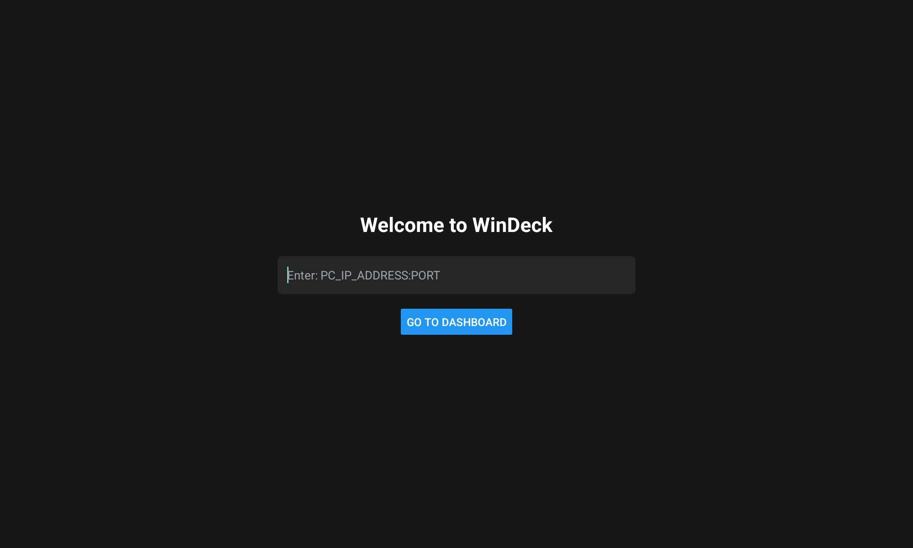
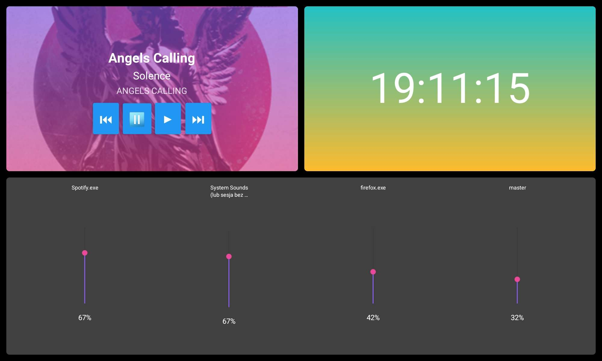

# 📱 WinDeck Client - Remote Mobile App

Mobile client for the WinDeck system. Built with React Native and Expo, this app connects to the Windows Server to control volume and media playback remotely.

> **🖥️ Looking for the PC Server?**
> The Server code (Python) can be found here: [WinDeck-ServerSide](https://github.com/DevvMarko/WinDeck-ServerSide)

---

## 📸 Screenshots

| Connection Screen | Control Panel |
|:---:|:---:|
|  |  |

## 🚀 Features

* 🔗 **Easy Connection:** Simply enter the IP and Port provided by the server console.
* 🎚️ **Volume Slider:** Real-time volume adjustment.
* 🎵 **Media Controls:** Play, Pause, Skip, and Rewind buttons.
* 🎨 **Modern UI:** Clean and responsive interface.

## 🛠️ Tech Stack

* 
* 
* 

---

## 📥 Download & Install (APK)

To install the application on your Android device:

1. Go to the **[Releases](https://github.com/DevvMarko/WinDeck-ClientSide/releases/tag/v1.0.0)** section on the right.
2. Download the latest `WinDeck-Client.apk` file.
3. Transfer the file to your phone and install it.
4. **Important:** Ensure your phone and PC are connected to the same Wi-Fi network!

---

## 💻 Local Development

To run the app in debug mode or modify the code:

### Prerequisites
* Node.js
* Expo CLI (optional)

### Steps
1. Clone the repository:
   ```bash
   git clone https://github.com/DevvMarko/WinDeck-ClientSide.git
2. Install dependencies:
   ```bash
   npm install
3. Start the project
   ```bash
   npx expo start
4. Scan the QR code with the Expo Go app or run on an Android Emulator.

---

## 📜 License

This project is licensed under the MIT License - see the [LICENSE](LICENSE) file for details.

## ✍️ Author

Project created by [@DevvMarko](https://github.com/DevvMarko) and I invite you to visit the author's portfolio page [mbarchanski.pl](https://mbarchanski.pl)